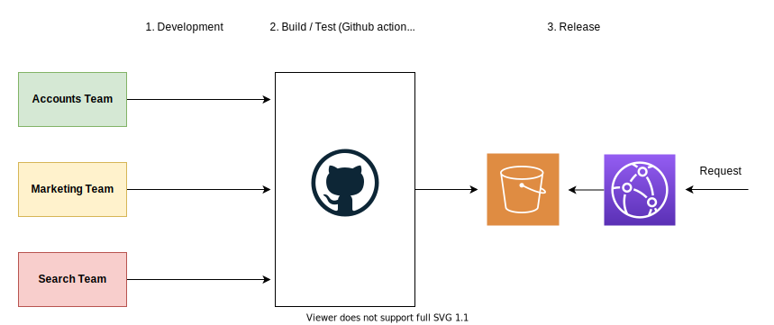

# Webpack 5: Module Federation (proof of concept) 

Testing out the module federation in webpack 5.

This is an experimental project and it is not intended for production use. 

Proof of concept of isolated application stitched together with webpack 5 module federation. 
- [Getting started](#getting-startd)  
- [Production](#production)  
- [Project Summary](#project-summary)  
- [Architeture](#architecture)  
- [Technologies](#technologies)  
- [Resources](#resources)  

## Getting started


#### 1. Starting the apps 

```sh
// Install deps
yarn

// Within root directory
yarn run start

// Visit http://localhost:4000

```
## Production 

### 1. Create infrastructure (via terraform) 

TODO

### 2. Setup Build Environments Variables (Github actions)

These need to be set on the github secrets for your workflows to work. These will all be available and created via terraform.

|  Name        | Description    |
| ------------- |:-------------:| 
| WEBSITE_HOST  | Website domain or cloudfront domain |
| AWS_ACCESS_KEY_ID  | Build AWS Access key id |
| AWS_SECRET_ACCESS_KEY  | Build AWS Access key |
| AWS_CF_DISTRIBUTION_ID  | Cloudfront distribution id |

## Project Summary 

Kittygram. View and search for photos of cats, and manage your account.


#### Teams

Teams are divided are split up into respective functions. 

1. Marketing Team    - Host application (home page, common, and tying everything together)
2. Accounts Team     - Account Flows (profiles, login, logout, favourites etc)
3. Search Team       - Search Flows (Search results, display) 


## Architecture 

Separate delivery pipeline which allows for independent releases in the holistic web application.

Even though the teams and projects are separate, the code base is shared via monorepo (lerna).


#### Overview of architecture 



## Technologies

- [Webpack](https://github.com/webpack/webpack) Version ^5.4.0 
- [React](https://github.com/facebook/react) Version ^17.0.1 
- [React DOM](https://github.com/facebook/react) Version ^17.0.1 
- [React Router](https://github.com/ReactTraining/react-router)
- [Material UI](https://github.com/mui-org/material-ui) Version ^4.11.0 
- AWS (cloudfront, s3)
- Terraform 

## Resources

- [Webpack 5 Module Federation: A game-changer in JavaScript architecture](https://indepth.dev/webpack-5-module-federation-a-game-changer-in-javascript-architecture/)
- [Webpack 5 Documentation](https://webpack.js.org/concepts/module-federation/)
- [Webpack 5 and Module Federation - A Microfrontend Revolution](https://dev.to/marais/webpack-5-and-module-federation-4j1i)
